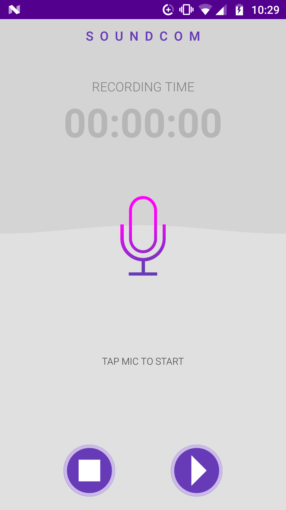

# What is Soundcom? 
### _Soundcom_ is a powerful audio encoder. It can transmit encoded data using sounds. Its simple UI & instant start make it very easy to use.  You can reliably record your meetings, speeches, lectures, songs etc. and make great moments sound fantastic.

# Features:

-  Records voice with high quality.
-  Simple user interface, easy to use.
-  Recording in background (even when display is off)
-  Format file: mp4
-  Record, Stop, Play audio file.
-  Save the recording file. 
-  Consumes low memory & battery.

# Dependencies

- [Quietnet](https://github.com/Katee/quietnet)
- [Pyaudio](https://people.csail.mit.edu/hubert/pyaudio/)

# Setting up the Project

- Fork the repository by clicking on the Fork icon at the top right corner of the repository page.
- Clone the repository on to your local machine by running the following commands on git:
- `git clone https://github.com/[YOUR-USERNAME]/soundcom.git` Refer to [forking](https://help.github.com/articles/fork-a-repo/) and [cloning](https://help.github.com/articles/cloning-a-repository/) in git if you are stuck somewhere.
- Download and install Android Studio which is an IDE for android application development.
- You will also need to download the Android SDK from the IDE itself.

# Development Setup

- Launch Android Project
- You will see a "Welcome to Android" window. Under Quick Start, select Import Project (Eclipse ADT, Gradle, etc.)
- Navigate to the directory where you saved the Soundcom project, select the root folder of the project (the folder named "Soundcom-master"), and hit OK. 
- Android Studio should now begin building the project with Gradle.
### Now build your project and test it.

# Running the Application
### You can run the application by two ways:

- Via your own android smartphone

Enable USB Debuuging in your phone.
Click Run on the Android Studio tool bar, or Shift + F10 to run the app.
By running a virtual device.

- Setup a Android Virtual Device in the IDE.

Then running the application by clicking on Run on the Android Studio tool bar, or Shift + F10 and then choose the newly created virtual device to run the app.

After following either of these methods, the app should look like this:

